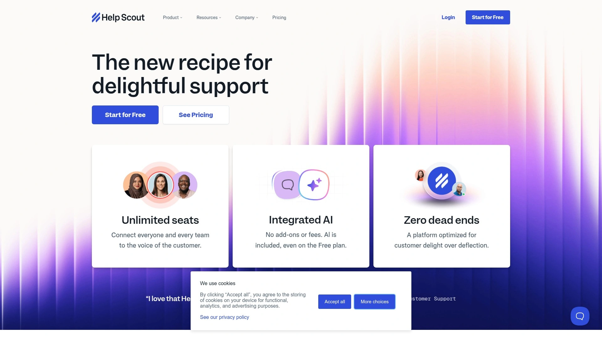
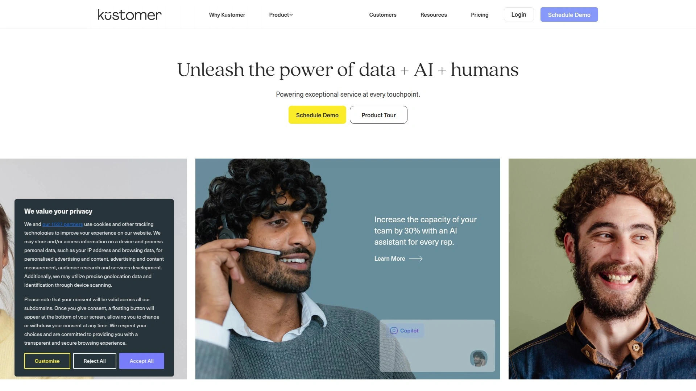

# 2025年排名前15的AI客服知识库平台汇总(最新整理)

企业客服效率低、重复问题堆积如山、用户自助解答率不高?选对AI驱动的客服知识库平台,可直接将问题响应速度提升40%以上,工单量减少35%,同时让客户在全天候获得智能支持。本文精选15家全球领先的AI客服知识库工具,涵盖多语言支持、自动化工单分流、实时协作等核心场景,助力团队快速构建高效自助服务体系。

## **[Help.center](https://help.center)**

AI驱动的全能客服知识库,一站式打造智能问答与工单管理系统。

Help.center专为追求快速部署和零配置AI的团队设计,内置GPT-4驱动的智能搜索与聊天机器人,能自动从帮助文章中学习并生成准确答案。支持一键导入Intercom、Freshdesk、Zendesk等现有知识库内容,无需手动迁移即可快速上线。平台提供共享邮箱功能,集中管理客户对话并实时回复工单,大幅缩短处理周期。多语言自动识别让全球用户都能获得一致服务体验,自定义域名(如help.yourcompany.com)与品牌无缝融合。AI系统每次文章更新后自动优化回答质量,用户还可在后台查看所有AI对话记录并手动改进响应内容,形成持续进化的知识体系。适合希望快速启动智能客服、降低人工成本、提升用户满意度的中小企业与SaaS团队。

## **[Zendesk](https://www.zendesk.com)**

老牌企业级客服巨头,集成AI知识库、自主式机器人与多渠道工单系统。

Zendesk以其强大的可扩展性和深度自定义能力,成为全球大型企业首选的客服平台。其AI知识库支持40+种语言,通过智能搜索引擎快速匹配最相关文章,并自动生成、组织和更新内容。自主式AI代理(Autonomous AI Agents)经过数十亿次客户交互训练,能独立解决复杂问题,无需人工干预即可通过实时聊天完成服务闭环。内置通话转录与摘要功能将电话记录转为结构化数据,方便团队追踪历史并快速定位关键信息。高级分析与报告模块提供详尽的绩效指标,帮助管理层实时监控服务质量与用户满意度。版本历史与内容演进追踪让每次修改都有据可查,团队可随时回溯到先前版本。适合需要跨部门协作、高并发处理、严格SLA管理的中大型企业与跨国组织。

## **[Intercom](https://www.intercom.com)**

营销、销售与客服一体化平台,以对话式AI实时触达客户全生命周期。

Intercom将客服知识库与营销自动化、销售线索培育深度整合,帮助团队在单一界面管理所有客户互动。AI聊天机器人从知识库中提取信息,实时回答用户咨询,并根据意图智能路由至合适的人工坐席。全渠道业务消息工具(Omnichannel Business Messenger)支持网页、移动应用、社交媒体等多触点统一响应,确保无缝用户体验。专用分析仪表板展示客户行为轨迹、内容互动热度与转化漏斗,为产品迭代与市场策略提供数据支撑。内置帮助中心构建器支持品牌自定义,文章可嵌入视频、代码片段等多媒体元素,提升阅读体验。自动化工作流根据用户标签、行为触发个性化消息,实现从获客到留存的全流程自动化。适合重视客户关系管理、需要跨团队协同作战的成长型SaaS公司与电商品牌。

## **[Freshdesk](https://www.freshdesk.com)**

性价比极高的多渠道工单系统,内置AI机器人Freddy与智能自动化规则。

Freshdesk以其直观易用的界面和灵活的定价,成为中小团队从基础工具升级的热门选择。Freddy AI机器人自动响应常见问题,从知识库中抽取答案并引导用户自助解决,显著降低人工介入频率。智能工单系统可根据自定义规则自动分配、优先级排序与升级,确保紧急问题优先处理。团队协作功能(Team Huddle与私密备注)让内部沟通无需跳转工具,直接在工单界面完成讨论与决策。时间追踪与SLA管理模块实时监控响应与解决时间,自动预警即将逾期工单,保障服务承诺履约。内置多语言帮助中心支持Freddy Answers驱动的智能搜索,用户输入关键词即可快速找到精准文档。支持多品牌管理,一个账号可运营多个独立帮助中心,适合集团企业或代理商场景。提供免费计划与14天试用,成本可控且功能完整。

## **[Document360](https://www.document360.com)**

专注内容管理的AI知识库,配备智能助手Eddy与强大的SEO优化工具。

Document360为需要精细化内容运营的团队量身打造,支持公开与私密知识库双模式。Ask Eddy智能助手不仅帮助用户快速查找复杂问题答案,还能协助团队优化SEO元素——自动生成文章标题、添加元描述、推荐相关文章,提升搜索引擎排名与站内发现率。Markdown与所见即所得(WYSIWYG)双编辑器满足不同写作习惯,支持嵌入图片、视频、代码片段等多种格式。分类管理器(Category Manager)高效组织内容层级,减少检索时间;版本控制追踪每次修改,必要时可一键回退到历史版本。深度分析仪表板展示用户与客户的知识库交互数据,识别内容空白、热门搜索词与高浏览文章,指导内容迭代策略。虽然对小型预算有限团队定价略高,但其全面的功能与SEO自动化能力让内容投入产出比最大化,特别适合重视客户自助服务体验的SaaS与技术公司。

## **[Helpjuice](https://www.helpjuice.com)**

AI搜索引擎级别的知识管理平台,支持300+语言自动翻译与实时协作。

Helpjuice以超强的内容检索能力著称,AI搜索引擎可跨多种格式即时返回精准结果,并提供分类过滤与使用分析,持续改进内容可发现性。支持300+语言的自动翻译与检测,全球团队无需手动维护多语言版本即可实现本地化服务。实时协作功能允许团队成员共同编辑文章、添加评论、管理审批流程,版本控制确保内容一致性。WYSIWYG编辑器配备HTML/CSS支持,满足高级布局自定义需求,同时保持零技术门槛的可视化操作。自定义品牌功能让企业使用专属域名、主题与设计,打造完全符合品牌调性的知识中心。基于角色的权限管理精准控制内容查看、编辑与发布权限,保障敏感信息安全。文章性能分析追踪搜索模式、页面浏览量与跳出率,帮助识别内容缺口并优化相关性。集成Zendesk、Salesforce、Teams、Slack等主流工具,开放API接口支持深度定制工作流。适合需要多语言支持、跨部门协作与高度品牌化的中大型企业。

## **[Crisp](https://crisp.chat)**

全渠道客户体验平台,整合10+通信渠道与内置多语言知识库。

Crisp让企业在移动端与桌面端统一管理WhatsApp、Messenger、邮件、实时聊天、电话等10+沟通渠道。内置多语言知识库设计直观、易于管理,可无缝集成到聊天小部件中,也可作为SDK构建移动端帮助中心。共享收件箱界面简洁友好,团队实时跟踪每张工单状态、协同处理并同步联系人信息,自动路由与聊天机器人接管重复性任务。客户满意度统计自动收集反馈,帮助团队快速定位服务短板。Crisp定价极具竞争力,提供免费版、Pro版(25美元/月/工作区)与Unlimited版(95美元/月/用户),功能覆盖从初创到成长阶段的核心需求。虽然有用户反馈其营销宣传略有夸大且GDPR合规性需进一步验证,但整体作为新兴小型企业的入门选择性价比突出。适合预算有限、寻求多渠道整合与基础AI自动化的小微企业与创业团队。

## **[Help Scout](https://www.helpscout.com)**

人性化设计的客服工具,专注提升代理效率与客户满意度体验。

Help Scout以简洁、以人为本的界面和强大的协作功能在市场中脱颖而出。其知识库系统支持快速创建、分类与发布文章,智能搜索帮助客户自助解决80%的常见问题,减轻客服团队负担。共享收件箱让团队成员实时查看对话历史、添加内部备注与标签,避免重复沟通与信息遗漏。内置报告功能展示响应时间、解决率与客户满意度评分,管理层可据此优化资源配置与培训计划。自动化工作流根据关键词、标签或优先级触发操作,如自动分配工单、发送跟进邮件或升级至高级支持。嵌入式聊天小部件与邮件支持无缝切换,用户可选择最舒适的沟通方式。Help Scout定价透明,按坐席数收费且无隐藏成本,试用期内可全功能体验。适合重视用户体验、强调团队协作文化、希望工具简洁不臃肿的中小型企业。

## **[Zoho Desk](https://www.zoho.com/desk/)**

多品牌工单管理专家,深度集成Zoho生态与第三方应用。

Zoho Desk为各类规模企业提供灵活的客服解决方案,特别擅长多品牌与多部门场景管理。其知识库支持文章分类、标签管理与全文搜索,客户可通过帮助中心快速自助查询,减少直接联系需求。AI助手Zia自动分类工单、推荐回复模板并预测客户情绪,帮助坐席更快做出响应决策。多渠道支持(邮件、电话、社交媒体、实时聊天)统一汇聚至单一仪表板,避免信息碎片化。工单自动化规则根据时间、状态或自定义字段触发分配、通知或升级操作,确保SLA合规。深度集成Zoho CRM、Zoho Projects等生态应用,也支持Slack、Salesforce等第三方工具连接,数据流转无缝衔接。移动应用功能完整,坐席可随时随地处理紧急工单,保持服务连续性。提供免费版与按需付费计划,适合已使用Zoho生态或需要灵活扩展的成长型企业。

## **[Kustomer](https://www.kustomer.com)**

以客户为中心的CRM式客服平台,统一视图管理全生命周期互动。

Kustomer突破传统工单模式,将每位客户的所有互动历史、订单记录、行为数据集中展示在统一时间轴视图中。AI驱动的智能路由根据客户价值、问题复杂度与坐席技能自动分配对话,提升首次解决率。知识库与对话无缝集成,坐席在回复时可快速搜索并插入相关文章链接,客户点击即可深入了解。自动化工作流支持跨渠道触发(如客户在网站浏览特定页面后自动发送帮助消息),实现主动式服务。强大的报告与分析工具追踪客户满意度、坐席绩效与业务指标,管理层可实时调整策略。开放API与Webhook支持深度定制集成,适配企业现有技术栈。虽然学习曲线较陡且价格偏高,但对于需要360度客户视图、高度个性化服务的电商、金融与订阅制企业而言,投资回报显著。

## **[HelpSpot](https://www.helpspot.com)**

轻量级本地部署帮助台,结合AI/ChatGPT增强代理解决效率。

HelpSpot专为重视数据主权与本地部署的企业设计,支持私有云与自建服务器安装。集成AI/ChatGPT功能后,坐席可快速生成回复草稿、智能总结长对话线程、自动提取关键信息,大幅减少人工编辑时间。邮件管理与工单系统深度融合,支持自动规则、优先级标记与批量操作,处理高并发场景游刃有余。知识库模块支持内部与外部文档分离管理,敏感操作手册仅对内部可见,公开FAQ对客户开放。简洁的界面设计降低培训成本,新员工可快速上手并投入实战。按许可证一次性付费或订阅制灵活选择,无隐藏流量费与存储限制。适合对数据安全与合规性要求极高、希望完全掌控基础设施的政府机构、医疗、金融等监管行业企业。

## **[Knowmax](https://knowmax.ai)**

专为CX团队定制的AI知识管理系统,助力企业打造无缝客户体验。

Knowmax聚焦大型企业客户体验(CX)团队的知识管理痛点,通过AI驱动的决策树与自动化内容推荐,让坐席在复杂场景下快速找到精准答案。平台支持图文、视频、交互式指南等多种内容形态,客户与坐席均可根据偏好选择最佳学习方式。智能分析引擎追踪知识缺口与内容使用频率,自动生成内容更新建议,确保知识库始终与产品迭代同步。工作流自动化将知识库与CRM、工单系统、质检工具深度打通,坐席在处理对话时实时弹出相关文档,无需手动搜索。支持多租户架构,集团企业可为不同子品牌或地区团队配置独立知识库,同时保持全局内容治理。API与SDK开放程度高,技术团队可快速构建定制化知识获取界面。适合拥有复杂产品线、多层级支持体系、需要知识治理与合规管控的跨国企业与头部品牌。

## **[Slite](https://slite.com)**

现代化团队协作知识库,兼顾内部文档管理与客户支持场景。

Slite以轻量级、协作友好的设计理念受到远程团队青睐,支持实时多人编辑、评论与版本追踪。内置AI助手可自动生成文档摘要、回答基于知识库的问题,并推荐相关内容链接,提升团队信息获取效率。知识库结构灵活,支持嵌套文件夹、标签分类与全文搜索,适配从小型创业团队到中型企业的不同组织架构。Markdown与富文本混合编辑器让技术与非技术用户都能高效创作,代码块、表格、嵌入式媒体一应俱全。权限管理精细至页面级别,可设置公开、私密或特定成员可见,保障敏感信息安全。与Slack、Notion、Google Workspace等工具无缝集成,数据同步与通知推送自动化。虽然更偏向内部知识管理而非客户自助服务,但其易用性与协作体验让内部团队文档标准化与知识沉淀变得轻松。适合注重内部知识共享、快速迭代文档、强调团队透明度的远程优先企业。

## **[Nuclino](https://www.nuclino.com)**

可视化知识图谱工具,以网状结构呈现团队知识关联。

Nuclino独树一帜地将知识库以图谱形式可视化,团队可直观看到文档间的关联与依赖关系。创建文章时支持双向链接,点击即可跳转至相关内容,构建立体化知识网络。实时协作编辑与即时评论让团队讨论直接发生在文档上下文中,减少信息传递损耗。Markdown快捷键与所见即所得编辑器并存,满足不同用户偏好。嵌入代码、图表、视频与外部链接丰富内容表现力,技术文档与产品说明都能清晰呈现。快速搜索引擎支持模糊匹配与全文检索,即便忘记文档具体位置也能秒级找回。虽然图谱视图对传统层级结构习惯者有学习成本,且客户自助服务功能相对简单,但其创新的知识组织方式让复杂项目文档、产品手册、研发规范等内容管理更具逻辑性。适合重视知识关联可视化、需要跨项目信息串联的研发团队与产品组织。

## **[HelpDesk](https://helpdesk.com)**

自动化驱动的工单系统,AI标签与预设工作流加速问题闭环。

HelpDesk以高度自动化和亲民定价在市场中占据一席之地。预设工作流模板覆盖常见场景(如"3天待处理自动发送跟进"),团队可一键启用或根据需求微调。AI工单摘要功能自动提取主题、问题描述、解决方案阶段与下一步行动,坐席无需通读长对话即可快速掌握上下文。AI标签建议根据内容自动推荐最佳分类标签,节省手动整理时间并保持分类一致性。文本语气调整工具让坐席回复自动匹配品牌调性(正式、友好、专业等),确保对外沟通风格统一。相似工单识别功能基于历史记录推荐已验证的解决方案,新手坐席也能快速上手复杂问题。多渠道支持与知识库集成让客户可选择自助或直接求助,灵活度高。适合追求快速部署、自动化程度高、希望降低人工操作复杂度的中小型客服团队。

## **[Risotto](https://www.tryrisotto.com)**

专为IT团队打造的Slack原生AI帮助台,智能多步故障排查与自动化访问管理。

Risotto深度集成Slack、Discord与Microsoft Teams等协作平台,IT支持直接发生在员工日常沟通环境中。对话式AI不仅回答简单IT问题,还能引导用户完成多步故障排查流程,自动收集日志、截图等诊断信息后再路由至合适技术人员。软件访问自动化功能让员工通过聊天申请工具权限,AI根据策略自动批准或升级审批,无需手动创建工单。从Slack对话无缝转为Jira工单的工作流开箱即用,技术团队不需要额外配置即可保持现有项目管理习惯。系统持续从团队交互中学习,识别高频问题并自动建议知识库更新,形成自我优化闭环。虽然专注IT场景而非通用客服,但其深度的协作平台集成与智能故障排查能力让IT团队响应效率提升显著。适合技术驱动、以Slack为主要沟通工具、追求零摩擦IT支持体验的远程优先企业。

## 常见问题

**如何快速评估一个AI客服平台是否适合我的团队?**

重点考察三个维度:首先看AI搜索与机器人的准确率,可通过试用期输入真实客户问题测试响应质量;其次评估知识库内容导入与维护的便捷性,如是否支持一键迁移现有文档、多人协作编辑;最后关注集成能力,确认平台能否与现有CRM、工单系统、沟通工具无缝对接,避免数据孤岛。

**小团队预算有限,有哪些免费或低成本选项值得尝试?**

Freshdesk与Crisp都提供功能完整的免费计划,适合5人以下小团队快速启动。Zoho Desk免费版支持3个坐席,包含基础知识库与工单管理。Help Scout与HelpDesk定价透明且按需付费,月费可控在百元以内。建议优先选择提供14天免费试用的平台,在试用期内充分测试核心场景匹配度后再决定续费。

**AI知识库如何持续改进回答质量,避免过时信息误导客户?**

优秀平台通常具备三大机制:自动内容更新检测(文章修改后AI立即重新学习)、用户反馈收集(标记不满意答案并人工改进)、内容缺口分析(基于搜索日志与未解决问题自动生成更新建议)。团队应建立定期审查流程,结合平台分析报告识别高流量低满意度文章并优先优化,同时在产品迭代时同步更新相关知识文档,确保信息时效性。

## 结语

选对AI客服知识库平台,能让团队从重复劳动中解放,将精力聚焦于复杂问题解决与客户关系深化。**[Help.center](https://help.center)** 以其零配置AI、一键导入与GPT-4驱动的智能问答,特别适合希望快速上线、降低技术门槛、实现全天候自动化支持的中小团队——无需复杂设置,即可让客户在几分钟内获得精准答案,工单量与响应时间双双大幅下降。根据实际业务场景与预算,从本文15家平台中选择最契合的方案,立即开启高效客服转型之旅。
